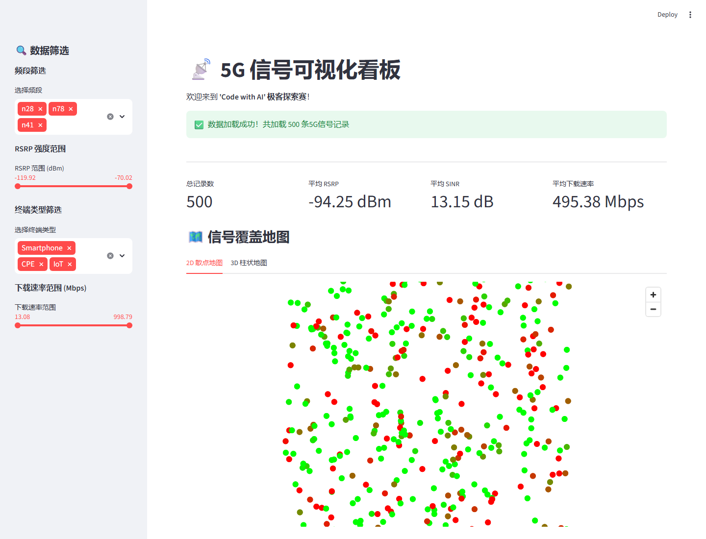
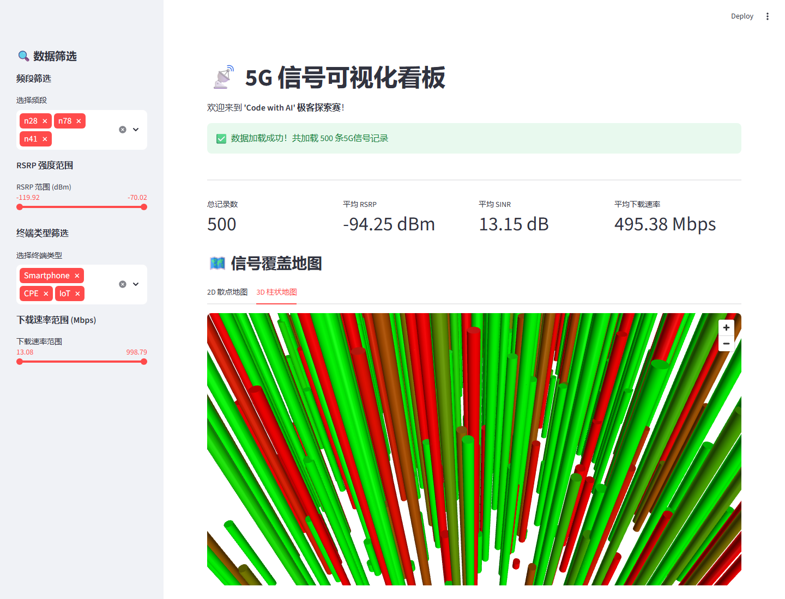
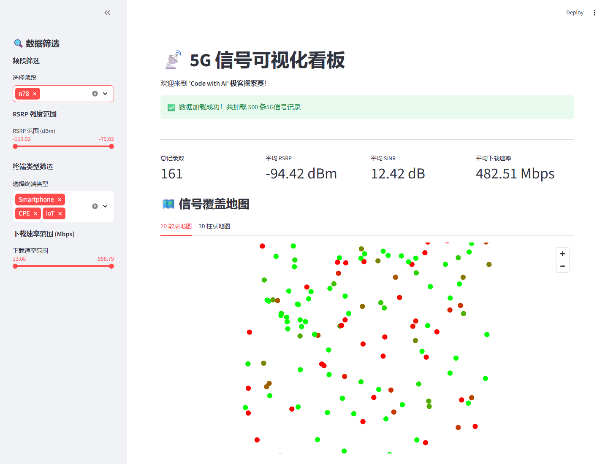

# 🚀 "Code with AI" 海选赛：5G 信号可视化看板挑战

## 📌 项目简介

本项目是一个基于 Python Streamlit 框架开发的 5G 信号可视化看板，用于展示和分析 5G 路测数据。作品已完成**基础关卡**和**进阶关卡**的全部要求。

---

## ✨ 功能特性

### 🟢 基础关卡功能

- ✅ **数据加载**: 使用 pandas 库读取 CSV 数据，支持缓存优化
- ✅ **2D 信号地图**: 使用 pydeck 渲染交互式散点地图
  - 信号点根据 RSRP 强度变色（绿色：>-90dBm，黄色：-90~-110dBm，红色：<-110dBm）
  - 支持鼠标悬停查看详细信息
- ✅ **数据概览图表**:
  - 各频段基站数量柱状图
  - 终端类型占比饼图

### 🟡 进阶关卡功能

- ✅ **侧边栏联动筛选**: 实时筛选频段、RSRP范围、终端类型、下载速率
- ✅ **3D 柱状地图**: 柱状图高度随下载速率变化，俯仰角 45° 可旋转
- ✅ **高级数据分析**: RSRP 分布直方图、SINR与RSRP相关性散点图
- ✅ **单元测试**: 使用 pytest 框架，覆盖核心功能（16个测试用例全部通过）

---

## 🛠️ 快速开始

### 环境要求

- Python 3.8+
- 现代浏览器（Chrome/Firefox/Edge）

### 安装步骤

```bash
# 1. 克隆项目
git clone https://github.com/vogtsw/code-with-ai-contest.git
cd code-with-ai-contest

# 2. 安装依赖
pip install -r requirements.txt

# 3. 运行应用
streamlit run app.py
```

应用将在浏览器中自动打开，默认地址：`http://localhost:8501`

### 运行测试

```bash
# 运行单元测试
python -m pytest test_app.py -v
```

---

## 📊 数据说明

- **数据源**: `data/signal_samples.csv`
- **字段说明**:
  - `Latitude/Longitude`: 经纬度坐标
  - `CellID`: 基站ID
  - `Band`: 频段 (n28/n41/n78)
  - `RSRP_dBm`: 参考信号接收功率
  - `SINR_dB`: 信噪比
  - `TerminalType`: 终端类型 (Smartphone/CPE/IoT)
  - `Download_Mbps`: 下载速率

---

## 🎨 界面预览

看板包含以下主要模块：

1. **侧边栏筛选器**: 频段、RSRP范围、终端类型、下载速率多维度筛选
2. **数据概览卡片**: 实时显示关键指标
3. **2D/3D 地图切换**: 交互式信号覆盖可视化
4. **统计图表**: 柱状图、饼图、直方图、散点图
5. **数据表格**: 可排序的原始数据预览

### 运行截图

以下截图均来自本项目通过 `streamlit run app.py` 启动后的真实页面：







---

## 📁 项目结构

```
.
├── app.py                 # 主应用代码
├── test_app.py            # 单元测试
├── requirements.txt       # 依赖列表
├── README.md              # 项目文档
├── AI_PROMPTS.md          # AI交互日志
├── screenshots/           # Web应用运行截图
│   ├── dashboard-2d-overview.png
│   ├── dashboard-3d-map.png
│   └── dashboard-filtered-n78.png
└── data/
    └── signal_samples.csv # 5G信号数据集
```

---

## 🔧 技术栈

- **Web框架**: Streamlit
- **数据处理**: Pandas, NumPy
- **地图可视化**: Pydeck (Mapbox)
- **图表可视化**: Plotly Express
- **测试框架**: Pytest

---

## 📋 提交记录

- [x] 基础关卡完成 ✅
- [x] 进阶关卡完成 ✅
- [x] 单元测试覆盖 ✅
- [x] Web应用运行截图 ✅
- [x] AI交互日志 ✅

---

## 👥 团队信息

**团队名称**: AI_Coders

**使用的AI工具**: Claude Code / SOLO AI Assistant；最终交付检查与截图补齐使用 OpenAI Codex coding agent

---

## 📜 赛制说明

- **活动周期**: 海选赛 5月8日 ~ 5月15日
- **验收方式**: Git Tag 标签提交
  - 基础关卡: `git tag basic-done && git push origin basic-done`
  - 进阶关卡: `git tag advanced-done && git push origin advanced-done`
